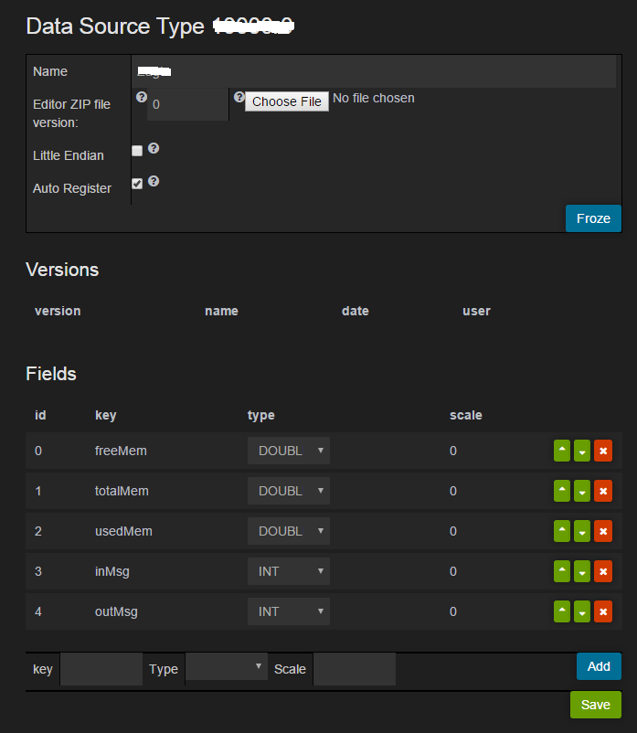

MQTT Android java client metric and log sending sample for [www.tinovi.io](www.tinovi.io) IoT cloud service.

This sample shows how to use tinovi cloud to add remote debugging option to you application.
Before using this demo you should create account with tinovi cloud and define your private data source type in Admin->Dst.
Make sure you click Auto register option which enables all clients of this type auto registration to your organization.
Configure your data source type as shown in picture below, copy data source TypeId - on top of page and paste in `main` activity TYPE = "YOUR TYPE ID"

